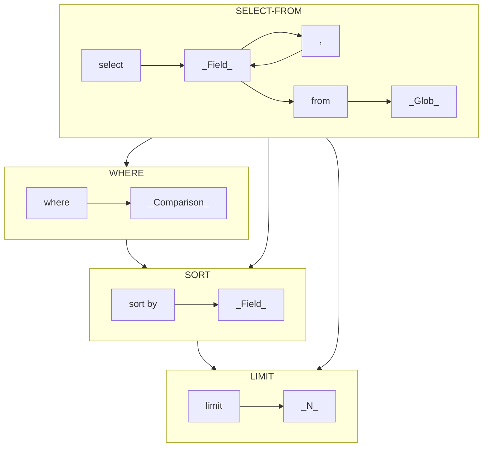
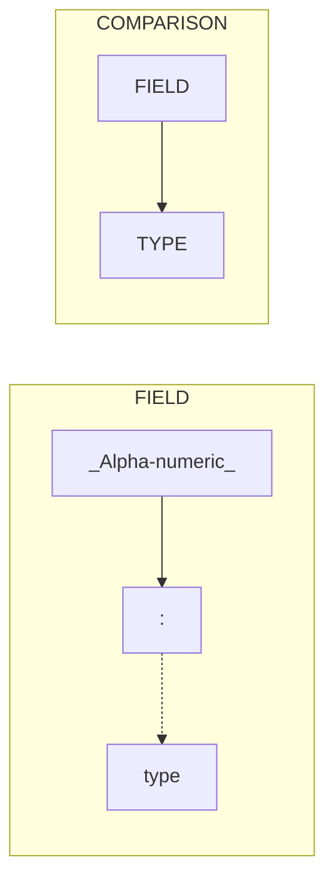

# Visual syntax
## Select

```mermaid
flowchart TB
	subgraph SELECT-FROM
		select --> field[_Field_] --> comma[","] --> field -->
		from --> glob[_Glob_]
	end
	subgraph WHERE
		where --> comparison[_Comparison_]
	end
	subgraph SORT
		sort[sort by] --> sfield[_Field_]
	end
	subgraph LIMIT
		limit[limit] --> number[_N_]
	end
	SELECT-FROM --> WHERE --> SORT --> LIMIT
	SELECT-FROM --> SORT
	SELECT-FROM --> LIMIT
```



```mermaid
flowchart LR
	subgraph FIELD
		 alphanum[_Alpha-numeric_] --> colon[:] -.-> type
	end
	subgraph COMPARISON
		f[FIELD] --> t[TYPE]
	end
```

		
```